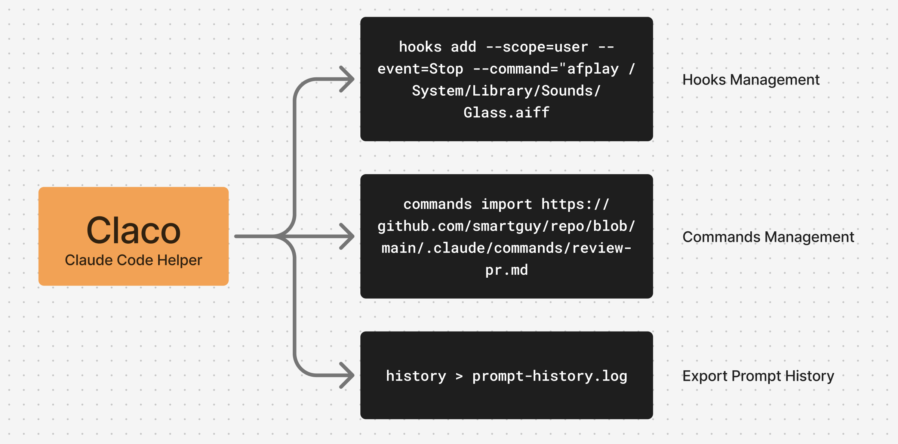

# claco - Claude Code Helper



`claco` (Claude Code Helper) is a CLI tool for boosting Claude Code productive.

## Features and Usage

- **hooks**: Manage hooks configuration
- **commands**: Manage slash commands configurations
- **history**: Lists all user input messages for the current project
- **projects**: Lists all projects with their session IDs
- **session**: Shows session info including first user message and timestamp
- **live**: Shows active claude code IDE sessions with PID and workspace info

Manage Hooks

```bash
# List all claude code hooks
claco hooks list
# Add stop sound notification
claco hooks add --scope=user --event=Stop --command="afplay /System/Library/Sounds/Glass.aiff
```

Manage Slash Commands

```bash
# List all claude code slash commands
claco commands list
# Import command from github repo
claco commands import https://github.com/amantus-ai/vibetunnel/blob/main/.claude/commands/review-pr.md
# Generate command via claude code cli
claco commands generate "Checkout yesterday's pull request and generate report"
```

List user messages in current project

```bash
# Show all user messages in the current directory's Claude project
claco history
# Or use the alias
claco showmeyourtalk > dev-prompt.log
# Show messages from a specific session
claco history --session 48fb8f8e-48e9-4eb8-b035-4b72deb386cf >> dev-prompt.log
```

## Installation

On Linux/macOS:

- Install from script `curl -fsSL https://raw.githubusercontent.com/kaichen/claco/main/install.sh | bash`
- Install from crates.io `cargo install claco`
- Install from Github(Unstable) `cargo install --git https://github.com/kaichen/claco`

*NOTICE* cargo is package manager from rust toolchain.

## License

MIT.
