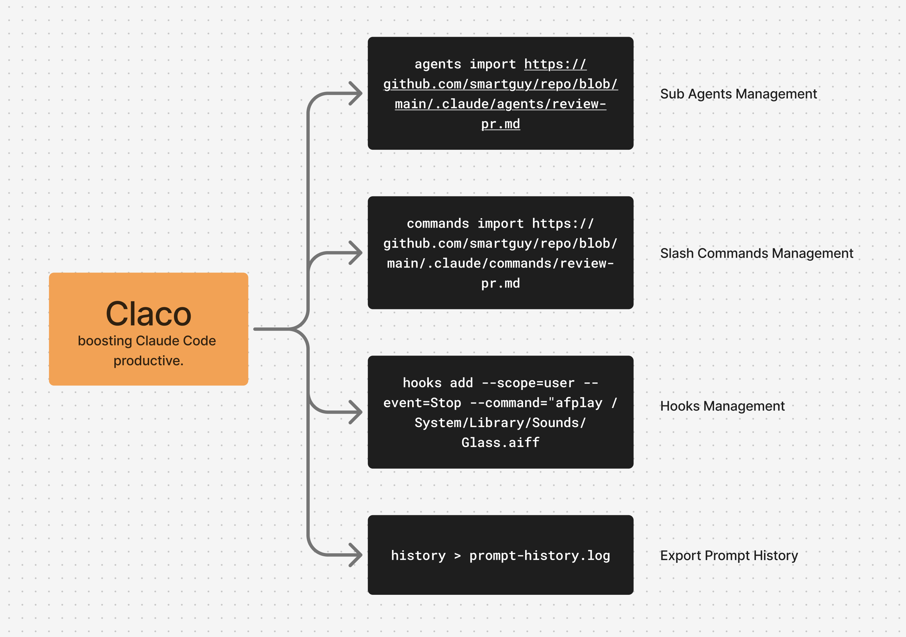

# claco - Claude Code 助手



`claco` (Claude Code Helper) 是一个用于提升 Claude Code 生产力的 CLI 工具。

[Readme in English](/README.md)

## 安装

在 Linux/macOS 上：

- 通过 Homebrew 安装（仅限 Mac）：`brew install kaichen/tap/claco`
- 通过脚本安装 `curl -fsSL https://raw.githubusercontent.com/kaichen/claco/main/install.sh | bash`
- 通过 crates.io 安装 `cargo install claco`
- 通过 Github 安装（不稳定版）`cargo install --git https://github.com/kaichen/claco`

*注意* cargo 是 rust 工具链的包管理器。

## 功能和使用

- **agents**：管理自定义代理（列出、导入、删除、清理、生成）
- **commands**：管理斜杠命令配置
- **hooks**：管理钩子配置
- **history**：列出当前项目的所有用户输入消息
- **session**：显示会话信息，包括第一条用户消息和时间戳
- **projects**：列出所有项目及其会话 ID

管理自定义子代理(Subagents)

```bash
# 列出所有自定义代理
claco agents list
# 从 GitHub 导入代理
claco agents import https://github.com/owner/repo/blob/main/agent.md --scope user
# 从本地文件导入代理
claco agents import ../my-agent.md --scope project
# 生成包含所有属性的代理模板
claco agents gen "my-agent"
```

管理斜杠命令(/command)

```bash
# 列出所有 claude code 斜杠命令
claco commands list
# 从 github 仓库导入命令
claco commands import https://github.com/amantus-ai/vibetunnel/blob/main/.claude/commands/review-pr.md
# 生成包含所有前置数据属性的命令模板
claco commands gen "my-command"
```

管理钩子(Hooks)

```bash
# 列出所有 claude code 钩子
claco hooks list
# 添加停止声音通知
claco hooks add --scope=user --event=Stop --command="afplay /System/Library/Sounds/Glass.aiff"
```

列出当前项目中的用户消息

```bash
# 显示当前目录的 Claude 项目中的所有用户消息
claco history
# 或使用别名
claco showmeyourtalk > dev-prompt.log
# 显示特定会话的消息
claco history --session 48fb8f8e-48e9-4eb8-b035-4b72deb386cf >> dev-prompt.log
```

## 许可证

MIT。
